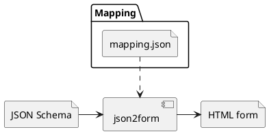

# Json2form
The objective of this tool is to convert a JSON schema to a HTML form.

The following goals are in mind:
1. The resulting HTML must be customisable
1. This tool shall not impose a specific HTML framework (e.g. Bootstrap)

Here is an overview of this tool architecture:


# Mapping
To provide a way of creating any HTML form, we developed a syntax to map each resulting type parsed to a HTML content.

The format of the mapping file is described in [this schema](./mappings/schema.json)

# Requirements
You need the following requirements:
- Python 3.9+
- [`madhac` library](https://github.com/Shireheart/madhac) in your PYTHONPATH

# Basic usage
A simple usage of this script is:
```bash
python3 main.py tests/zap_advanced_schema.json ./form.html --mapping mappings/simple_mapping.json
```

Json2form can also be used to insert the resulting content into an existing file with the `--insert` option.
